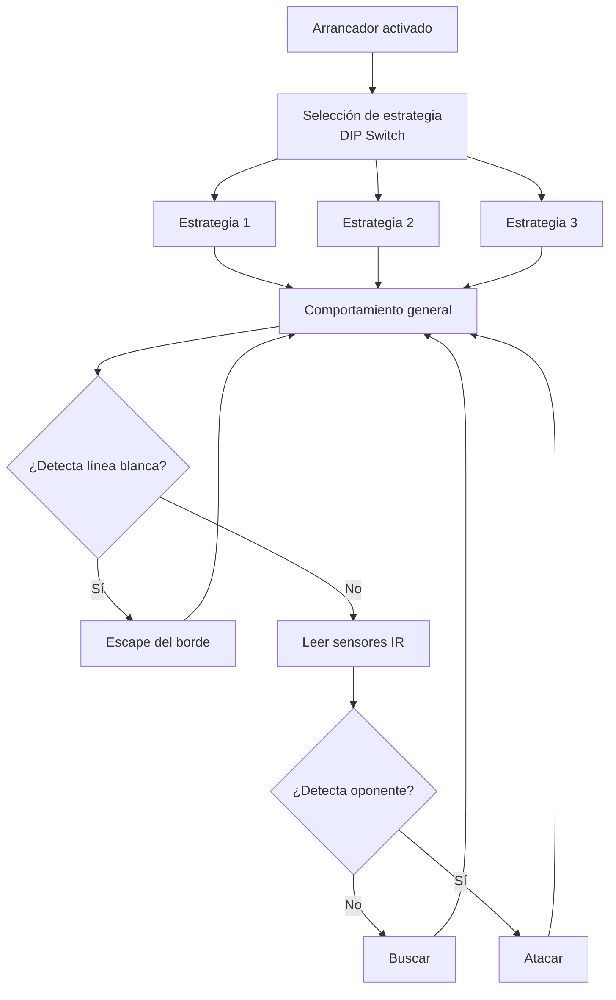

```mermaid
flowchart TD

    A[Arrancador activado] --> B[Selección de estrategia<br/>DIP Switch]

    B --> C[Estrategia 1]
    B --> D[Estrategia 2]
    B --> E[Estrategia 3]

    C --> F[Comportamiento general]
    D --> F
    E --> F

    F --> G{¿Detecta línea blanca?}

    G -- Sí --> H[Escape del borde]
    H --> F

    G -- No --> I[Leer sensores IR]

    I --> J{¿Detecta oponente?}

    J -- No --> K[Buscar]
    J -- Sí --> L[Atacar]

    K --> F
    L --> F
```
